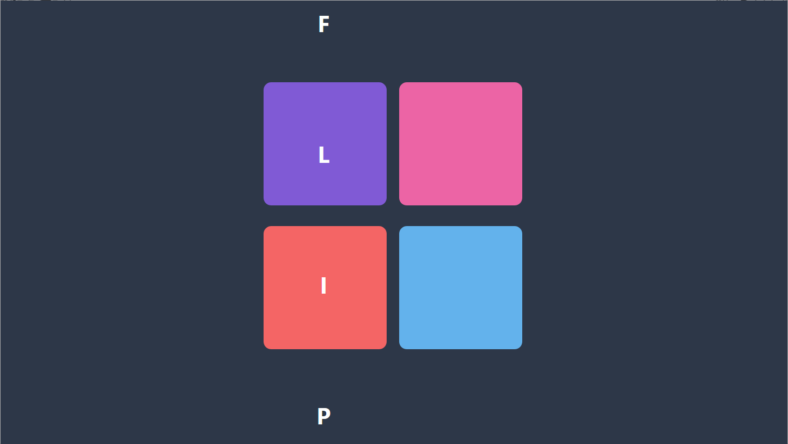
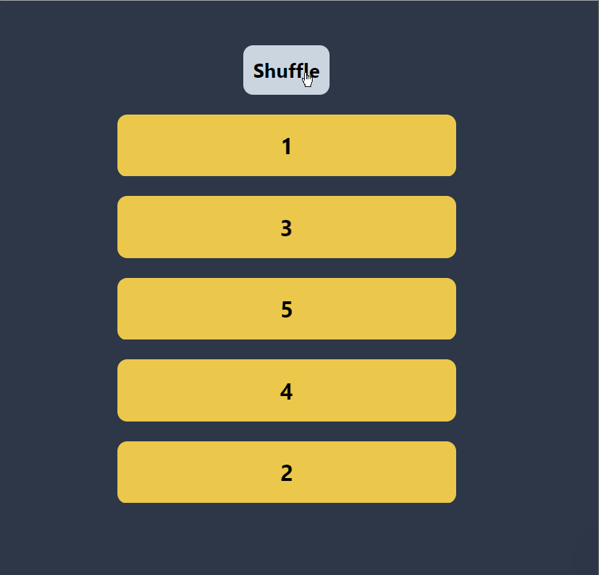
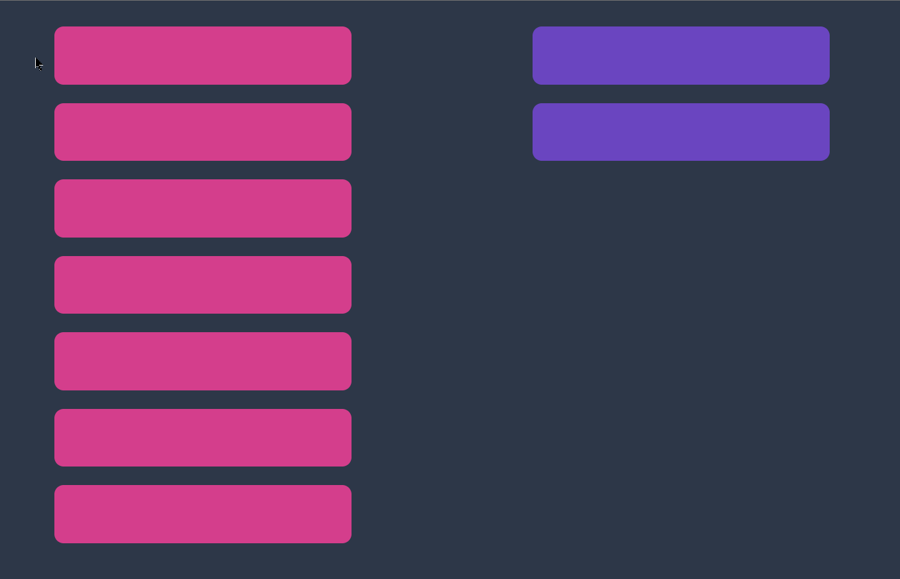
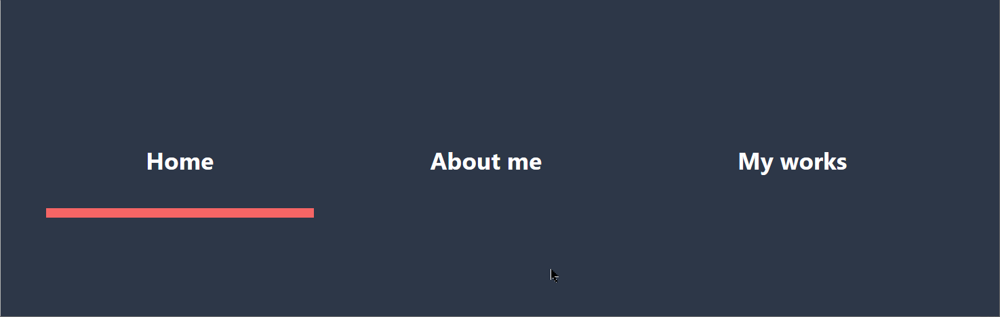
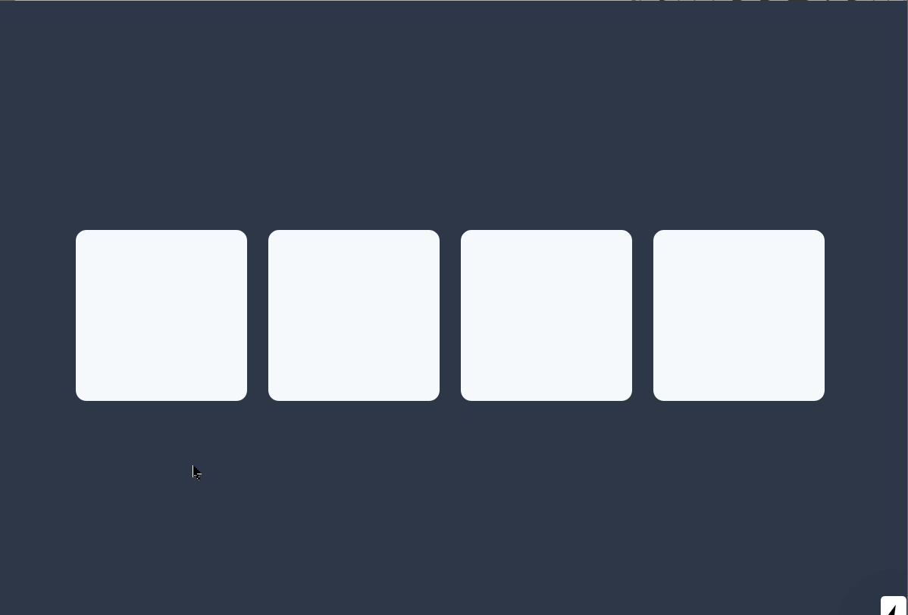

<p align="center">
  
</p>

# React Easy Flip

⚛ A lightweight React library for smooth FLIP animations

## Features

- Animates the unanimatable (DOM positions, mounts/unmounts)

- One hook for many usecases

- Uses the [Web Animations API](https://developer.mozilla.org/en-US/docs/Web/API/Web_Animations_API) (WAAPI)

* Stable and smooth 60fps animations

- SSR-friendly

* Built-in easing functions

- Lightweight

## Previous README versions

This is a README for 4.0.0-beta. The v3 README can be found [here](./README-v3.md).

## Demo

https://react-easy-flip-demo.now.sh/

Repository: [react-easy-flip-demo](https://github.com/jlkiri/react-easy-flip-demo)

You can also [read about how it works in detail here](https://css-tricks.com/everything-you-need-to-know-about-flip-animations-in-react/).

## Install

`npm install react-easy-flip@beta`

## Get started

1. Import `useFlip` hook and `FlipProvider`:

```javascript
import { useFlip, FlipProvider } from 'react-easy-flip'
```

2. Wrap your app (or at least a component that contains animated children) with a `FlipProvider`

```jsx
<FlipProvider>
  <MyApp />
</FlipProvider>
```

3. Assign a `data-flip-root-id` to any parent of the element(s) you want to animate

```jsx
<div data-flip-root-id="flip-root">
  <AnimatedChildren>
</div>
```

4. Pick a unique `data-flip-id` and assign it to the element(s) you want to animate. It can be the same as a `key` prop

```jsx

```

5. Use the hook by passing it the root ID you picked in (3)

```javascript
useFlip(rootId)
```

And that's it!

## Usage details

### useFlip

`useFlip` requires one argument, which is an ID of the root, i.e. any parent whose children you want to animate. You can optionally pass an options object with animation options (see details below) as a second argument. Third argument is the optional dependencies which you would normally pass to a `useEffect` hook: use it if you need to explicitly tell `react-easy-flip` that items you want to animate changed.

```
useFlip(rootId, animationOptions, deps)
```

#### Animation optons

Animation options is an object.

|    Property    |    Default     | Required |    Type    |                            Details                            |
| :------------: | :------------: | :------: | :--------: | :-----------------------------------------------------------: |
|   `duration`   |      400       | `false`  |  `number`  |                    Animation duration (ms)                    |
|    `easing`    | `easeOutCubic` | `false`  | `function` | Easing function (that can be imported from `react-easy-flip`) |
|    `delay`     |       0        | `false`  |  `number`  |                        Animation delay                        |
| `animateColor` |     false      | `false`  | `boolean`  |       Animate background color of the animated element        |

Example:

```javascript
import { easeInOutQuint } from 'react-easy-flip`

const SomeReactComponent = () => {
  const animationOptions = {
    duration: 2000,
    easing: easeInOutQuint,
  }

  useFlip(rootId, animationOptions)

  return (
    <div data-flip-root-id="root">
      <div data-flip-id="flipped" />
    </div>
  )
}
```

### Exported easings

`react-easy-flip` exports ready-to-use easing functions. You can [see the examples here](https://easings.net/).

- linear
- easeInSine
- easeOutSine
- easeInOutSine
- easeInCubic
- easeOutCubic
- easeInOutCubic
- easeInQuint
- easeOutQuint
- easeInOutQuint
- easeInBack
- easeOutBack
- easeInOutBack

### AnimateInOut

While `useFlip` can animate all kinds of position changes, it does not animate mount/unmount animations (e.g. fade in/out). For this purpose the `<AnimateInOut />` component is also exported. To use it, simple wrap with it the components/elements which you want to be animated. By default the initial render is not animated, but this can be changed with a prop.

Every element wrapped with a `<AnimateInOut />` **must** have a unique key prop.

Example:

```javascript
import { AnimateInOut } from 'react-easy-flip`

const SomeReactComponent = () => {
  return (
      <AnimateInOut>
        <div key="flipped-1" />
        <div key="flipped-2" />
        <div key="flipped-3" />
      </AnimateInOut>
  )
}
```

Here are all props that you can pass to `<AnimateInOut />`:

|      Property       |   Default   | Required |         Type         |                            Details                             |
| :-----------------: | :---------: | :------: | :------------------: | :------------------------------------------------------------: |
|        `in`         |  `fadeIn`   | `false`  | `AnimationKeyframes` |                    Mount animation options                     |
|        `out`        |  `fadeOut`  | `false`  | `AnimationKeyframes` |                   Unmount animation options                    |
| `playOnFirstRender` |   `false`   | `false`  |      `boolean`       |                    Animate on first render                     |
|    `itemAmount`     | `undefined` | `false`  |       `number`       | An explicit amount of current children (see explanation below) |

What is `itemAmount` for? In most cases this is not needed. But if your element is animated with a shared layout transition (such as moving from one list to another), this means that it doesn't need an unmount animation. In order to avoid two animations being applied to one element, provide the amount. For example, if this is a todo-app-like application, keep the number of both todo and done items. Moving from todo to done doesn't change the total amount of items, but `<AnimateInOut />` does not know that until you tell it. See the recipes below.

## Comparison with other libraries

- `react-easy-flip` uses Web Animations API (WAAPI) for animations. No other library based on a [FLIP technique](https://aerotwist.com/blog/flip-your-animations/) currently does that.

- Similar to existing libraries such as [`react-overdrive`](https://github.com/berzniz/react-overdrive), [`react-flip-move`](https://github.com/joshwcomeau/react-flip-move) or [`react-flip-toolkit`](https://github.com/aholachek/react-flip-toolkit) (although only the latter seems to be maintained).

- Allows you to easily do so-called [shared layout animations](https://guides.codepath.com/android/shared-element-activity-transition) (e.g. smoothly move an element from one page/parent to another). Some examples are given below. This is what heavier libraries like [`framer-motion`](https://github.com/framer/motion) call Magic Motion.

- Additionally, `react-easy-flip` is the **only** lightweight FLIP library for React that provides animation via a hook. Currently `react-easy-flip` has the **smallest bundle size**. It also does not use React class components and lifecycle methods that are considered unsafe in latest releases of React.

## Recipes

### List sort/shuffle animation

[Go to code](https://github.com/jlkiri/react-easy-flip-demo/blob/master/pages/Shuffle.tsx)

<p align="center">
  
</p>

### Both x and y coordinate shuffle

[Go to code](https://github.com/jlkiri/react-easy-flip-demo/blob/master/pages/auto-shuffle.tsx)

<p align="center">
  
</p>

### Shared layout animation

This is an todo-app-like example of shared layout animations. Click on any rectangle to move it to another parent. Note that on every click an item is actually unmounted from DOM and re-mounted in the other position, but having the same `data-flip-id` allows to be smoothly animated from one to another position.

[Go to code](https://github.com/jlkiri/react-easy-flip-demo/blob/master/pages/shared-layout.tsx)

<p align="center">
  
</p>

### Shared layout animation (navigation)

One nice usecase for shared layout animation is navigation bars where we want to move the highlighting indicator smoothly between tabs.

[Go to code](https://github.com/jlkiri/react-easy-flip-demo/blob/master/pages/magic-nav.tsx)

<p align="center">
  
</p>

### In/out (mount/unmount) animation (opacity)

The fade in and out keyframes are default and work out of box (= you do not need to explicitly pass them).

[Go to code](https://github.com/jlkiri/react-easy-flip-demo/blob/master/pages/in-out.tsx)

<p align="center">
  
</p>

### In/out (mount/unmount) animation (translation)

An example of passing custom animation options to `<AnimateInOut>`. Here the images are moved in and out instead of simply fading in and out.

[Go to code](https://github.com/jlkiri/react-easy-flip-demo/blob/master/pages/in-out-pic.tsx)

<p align="center">
  
</p>

## Requirements

This library requires React version 16.8.0 or higher (the one with Hooks).

## Contribution

Any kind of contribution is welcome!

1. Open an issue or pick an existing one that you want to work on
2. Fork this repository
3. Clone your fork to work on it locally
4. Make changes
5. Run `yarn build:dev` and make sure that it builds without crash
